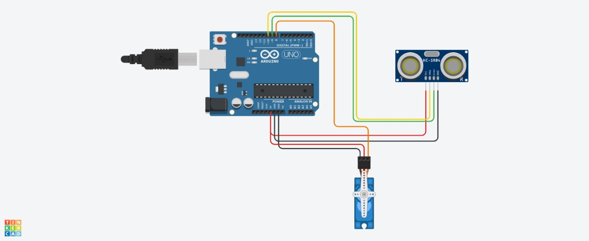

# 🕹️ Arduino Object Detection using Ultrasonic Sensor and Servo Motor

This simple Arduino project uses an **HC-SR04 ultrasonic sensor** to detect nearby objects and activates a **servo motor** based on the measured distance. It can be used as a basic obstacle detection or gate control system.

---

## 📁 Files in This Repository

- 📷 [`circuit_diagram.jpg`](circuit_diagram.jpg) – Wiring diagram showing the hardware setup.  
- 💾 [`object_detection.ino`](object_detection.ino) – Arduino sketch to detect distance and control the servo motor.

---

## 🔌 Hardware Required

- Arduino Uno  
- HC-SR04 Ultrasonic Distance Sensor  
- Servo Motor (SG90 or equivalent)  
- Jumper Wires  
- USB Cable  
- (Optional) Breadboard

---

## ⚙️ Circuit Diagram



### 🔗 Connections

#### HC-SR04 to Arduino:
| Sensor Pin | Arduino Pin |
|------------|--------------|
| VCC        | 5V           |
| GND        | GND          |
| Trig       | D10          |
| Echo       | D9           |

#### Servo to Arduino:
| Servo Pin | Arduino Pin |
|-----------|--------------|
| Signal    | D8           |
| VCC       | 5V           |
| GND       | GND          |

---

## 💡 How It Works

1. The **ultrasonic sensor** sends out an ultrasonic pulse and waits for the echo.
2. The time it takes for the echo to return is converted into a distance.
3. If an object is **closer than 10 cm**, the **servo rotates to 180°**.
4. Otherwise, the **servo remains at 0°**.
5. The distance is also printed to the Serial Monitor for observation.

---

## 🧾 Arduino Code Overview

```cpp
#include <Servo.h>
long time;
int distance;

const int trigPin = 10;
const int echoPin = 9; 

Servo servo1;

void setup() {
  pinMode(trigPin, OUTPUT); 
  pinMode(echoPin, INPUT);
  servo1.attach(8);
  servo1.write(0);
  Serial.begin(115200);
}

void loop() {
  digitalWrite(trigPin, LOW);
  delayMicroseconds(2);
  
  digitalWrite(trigPin, HIGH);
  delayMicroseconds(10);
  digitalWrite(trigPin, LOW);
  
  time = pulseIn(echoPin, HIGH);
  distance = time * 0.034 / 2;
  
  Serial.print("Distance: ");
  Serial.println(distance);

  if (distance < 10) {
    servo1.write(180);
  } else {
    servo1.write(0);
  }

  delay(50);
}
